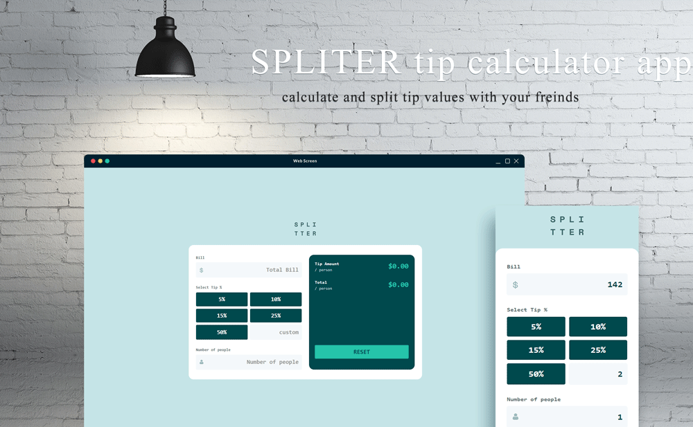

# Tip Calculator

  
*Your ultimate tool for calculating tips and splitting bills!*

## Overview

The **Tip Calculator** is a straightforward web application designed to help you calculate the tip amount for a bill based on a specified percentage and the number of people sharing the bill. It also provides the total amount per person including the tip. The app features preset tip percentages, a custom tip percentage input, and validation to ensure the number of people is greater than zero.

## Features

- **Bill Input:** Enter the total amount of the bill.
- **Tip Percentage:** Choose a tip percentage using preset buttons or input a custom percentage.
- **Number of People:** Enter the number of people to split the bill among.
- **Tip Calculation:** Calculates the tip amount and the total amount per person.
- **Reset Button:** Clears all inputs and resets the values to default.
- **Validation:** Ensures that the number of people is greater than zero.

## How to Use

To use the Tip Calculator, simply open the `index.html` file in your web browser. There is no need for any additional setup or installation.

### Steps

1. **Open the Application:**  
   Double-click on `index.html` to open it in your web browser.

2. **Enter Bill Amount:**  
   Type the total amount of the bill.

3. **Select Tip Percentage:**  
   - **Preset Percentages:** Click one of the percentage buttons (5%, 10%, 15%, 25%, 50%) to set the tip percentage.
   - **Custom Percentage:** Enter a custom tip percentage (e.g., `12`) in the "Custom" field.

4. **Enter Number of People:**  
   Type the number of people sharing the bill.

5. **View Results:**  
   The tip amount per person and the total amount per person (including the tip) will be displayed.

6. **Reset Values:**  
   Click the **Reset** button to clear all inputs and reset the values to default.

## Screenshots

### PC View

  
*Tip Calculator on a PC screen*

### Mobile View

  
*Tip Calculator on a mobile screen*

## Example

1. Enter a bill amount of `$100`.
2. Choose a 15% tip percentage.
3. Enter `4` for the number of people.
4. The app will display:
   - **Tip Amount:** `$3.75`
   - **Total Per Person:** `$25.00`

## Code Explanation

- **HTML Elements:**
  - `billElement`: Input for the total bill amount.
  - `buttons`: Preset percentage buttons for quick tip selection.
  - `numPeopleElement`: Input for the number of people.
  - `customPrecentageElement`: Input for a custom tip percentage.
  - `resetBtn`: Button to reset all values.
  - `errorMsg`: Error message for invalid number of people.
  - `tipOutput`: Displays the tip amount per person.
  - `totalOutput`: Displays the total amount per person including the tip.

- **JavaScript Functions:**
  - `calcTip()`: Calculates the tip amount and total per person based on the current inputs.
  - Event listeners for inputs and buttons to update calculations and manage errors.

```javascript
// Calculate the tip amount and total per person
let calcTip = () => {
    if (bill != 0 && numberOfPoeple != 0) {
        total = bill / numberOfPoeple;
        tipAmount = bill * precentage / numberOfPoeple;
        totaltip = total + tipAmount;
        totalOutput.textContent = '$' + Number(totaltip.toFixed(2));
        tipOutput.textContent = '$' + Number(tipAmount.toFixed(2));
    }
}
